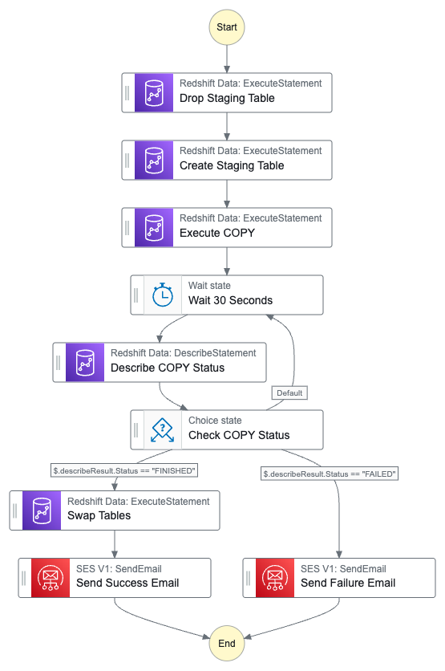
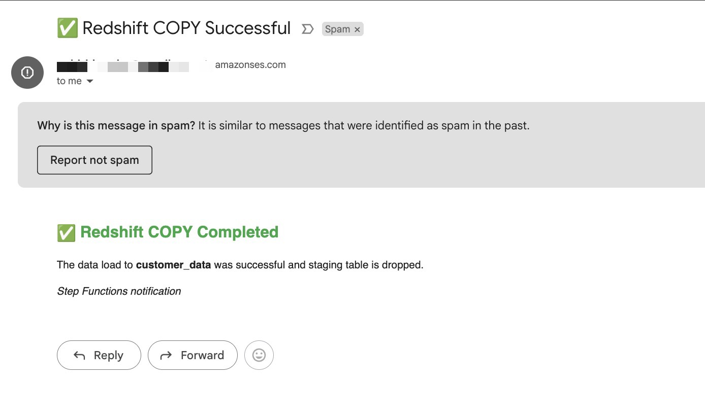

# AWS `S3 To Redshift` - Ingestion Pipeline Using Step Functions

A serverless data pipeline that automatically ingests customer data into Amazon Redshift when files arrive in S3.

The pipeline ensures ACID-compliant data replacement by truncating existing data and performing atomic `COPY` operations.

It leverages `AWS Step Functions`, `Lambda`, and `Redshift Data API` to handle large files, monitor job status, and send branded success/failure email notifications using `Amazon SES`.

Here is the final step function workflow:



> This step function is designed to handle large files and long-running operations. It uses a polling pattern to check the status of the `COPY` command in Redshift, ensuring that the data ingestion process is robust and reliable.

> The workflow is triggered by an S3 event, and it includes error handling and email notifications to keep you informed about the status of the data ingestion process.

Here is the sample email



> [!WARNING]
> * Make sure to replace your email address in the `step-function.json` file before deploying the step function.
> * Replace `<your-account-id>`, role-arn, and step-function-arn, `<your-step-function-name>`

### Key Features

* **Auto-triggered** on file upload to S3
* **Scalable ingestion** into Amazon Redshift Data API using `COPY`
* **Polling pattern** with Step Functions for long-running operations
* **ACID-compliant**: safely truncates and replaces data
* **HTML email notifications** via SES

---

Install `awscli` if you haven't already to proceed with following steps.

And then run `aws configure` to configure awscli with `secret key` and `access key`.

### Sample Data Generation

Generate sample data using Python script `main.py`. This script create `customer.csv` file around `50MB`.

Install the dependencies listed in the `requirements.txt` file. You can do this using pip:

```bash
>>> python3 -m pip install -r requirements.txt
```

Then run the script:

```bash
>>> python3 main.py
```

### Amazon S3 Bucket

Create an `S3 Bucket` to store the generated files. You can do this using the `awscli`.

```bash
>>> aws s3 mb s3://hack-with-harsha-sales-data2
```

Upload the generated `customer.csv` file to the S3 bucket. You can do this using the `awscli`.

```bash
>>> aws s3 cp customer.csv s3://hack-with-harsha-sales-data2/customer/
```

### Create `AWS Redshift Cluster`

```bash
>>> aws redshift create-cluster \
    --cluster-identifier customer-analytics \
    --node-type dc2.large \
    --number-of-nodes 2 \
    --master-username admin \
    --master-user-password testPassword123 \
    --db-name customer
```

Create default vpc if required

```bash
>>> aws ec2 create-default-vpc
```

Create a following table through `AWS Redshift Query Editor v2`

```sql
CREATE TABLE customer_data (
    order_id   VARCHAR(36)          NOT NULL,
    order_date DATE          NOT NULL,
    country    VARCHAR(100)  NOT NULL,
    amount     DECIMAL(12,2) NOT NULL,
    currency   VARCHAR(10)   NOT NULL
)
DISTKEY (country)
SORTKEY (order_date);
```

Create IAM role for `Redshift` to access `S3` bucket.

```bash
>>> aws iam create-role \
  --role-name RedshiftCopyRole \
  --assume-role-policy-document file://trust-policy.json
```

Add `policy` to the role.

```bash
aws iam put-role-policy \
  --role-name RedshiftCopyRole \
  --policy-name RedshiftS3ReadPolicy \
  --policy-document file://s3-read-policy.json
```

Attach the IAM role to our Redshift cluster, Replace `<your-account-id>` with your actual AWS account ID.

```bash
>>> aws redshift modify-cluster-iam-roles \
    --cluster-identifier customer-analytics \
    --add-iam-roles arn:aws:iam::<your-account-id>:role/RedshiftCopyRole
```

Use `Copy` command to load data into `Redshift` table from `S3` bucket.

```sql
COPY customer_data
FROM 's3://hack-with-harsha-sales-data2/customer/customer.csv'
IAM_ROLE 'arn:aws:iam::<your-account-id>:role/RedshiftCopyRole'
FORMAT AS CSV
IGNOREHEADER 1
REGION 'us-east-1';
```

In the above command, replace `<your-account-id>` with your actual AWS account ID.

---

> So Far, we have created a `Redshift` cluster and loaded data into it using `COPY` command. Now we will create a `Step Function` to automate the process of loading data into `Redshift` when a file is uploaded to `S3`.

### Create `AWS Step Function`

Use `step-function.json` file to create a `Step Function` state machine.

And then attach `redshift-policy.json` policy to the `Step Function` role as `inline-policy`.

Verify your email address in `Amazon SES` to send email notifications. Do this for both the `sender` and the `receiver` email addresses.

```bash
>>> aws ses verify-email-identity --email-address <your-email-address>
```

Send test email to verify the `Amazon SES` configuration.

```bash
>>> aws ses send-email \
  --from <your-email-address> \
  --destination "ToAddresses=<your-email-address>" \
  --message "Subject={Data=Test Email},Body={Text={Data=This is a test email.}}"
```

Now, attach `ses-policy.json` policy to the `Step Function` role as `inline-policy`.

### AWS Event Bridge

Create following role to allow `Event Bridge` to trigger the `Step Function`.

```bash
>>> aws iam create-role \
  --role-name AllowEventBridgeStartExecution \
  --assume-role-policy-document file://ses-trust-policy.json
```

Attach following policy to the role.

```bash
>>> aws iam put-role-policy \
  --role-name AllowEventBridgeStartExecution \
  --policy-name AllowStepFunctionExecution \
  --policy-document file://allow-stepfunction-execution.json
```

Replace the placeholders with your actual `Step Function ARN` and `role ARN`.

Enable S3 Event Notifications to EventBridge (via CLI)

```bash
>>> aws s3api put-bucket-notification-configuration \
  --bucket hack-with-harsha-sales-data2 \
  --notification-configuration '{"EventBridgeConfiguration": {}}'
```

Create EventBridge Rule (via CLI)

```bash
>>> aws events put-rule \
  --name trigger-stepfunction-on-customer-upload \
  --event-pattern '{
    "source": ["aws.s3"],
    "detail-type": ["Object Created"],
    "detail": {
      "bucket": {
        "name": ["hack-with-harsha-sales-data2"]
      },
      "object": {
        "key": ["customer/customer.csv"]
      }
    }
  }' \
  --state ENABLED
```


```bash
>>> aws events put-targets \
  --rule trigger-stepfunction-on-customer-upload \
  --targets '[
    {
      "Id": "TriggerStepFunction",
      "Arn": "arn:aws:states:us-east-1:<your-account-id>:stateMachine:<your-step-function-name>",
      "RoleArn": "arn:aws:iam::<your-account-id>:role/AllowEventBridgeStartExecution",
      "Input": "{\"triggeredBy\":\"S3 Event for customer.csv\"}"
    }
  ]'
```

### Cleanup

**Delete the Redshift Cluster**

```bash
>>> aws redshift delete-cluster \
  --cluster-identifier customer-analytics \
  --skip-final-cluster-snapshot
```

**Delete the s3 bucket**

```bash
>>> aws s3 rm s3://hack-with-harsha-sales-data2 --recursive
```

```bash
>>> aws s3 rb s3://hack-with-harsha-sales-data2 --force
```

**Remove EventBridge Rule Target**

```bash
>>> aws events remove-targets \
  --rule trigger-stepfunction-on-customer-upload \
  --ids $(aws events list-targets-by-rule \
    --rule trigger-stepfunction-on-customer-upload \
    --query 'Targets[*].Id' \
    --output text)
```

**Remove EventBridge Rule**

```bash
>>> aws events delete-rule --name trigger-stepfunction-on-customer-upload
```

- **Delete Step Function manually through console**

- **Delete IAM Roles and Policies that we created manually through console**